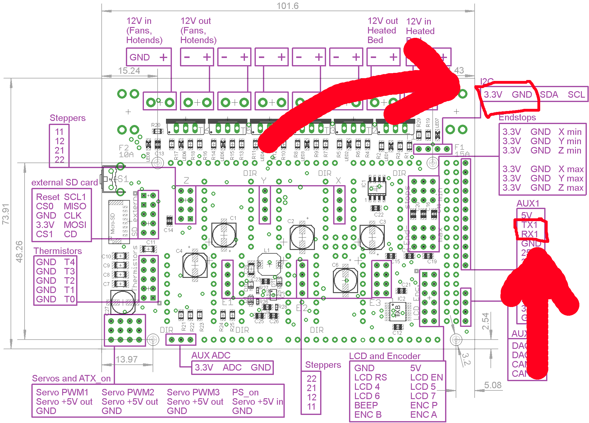

*3D Printer ESP8266 Web Interface*

This one nifty tool lets you use awesome web panel from Duet electronics on any other hardware that supports auxiliary serial connections. And RepRapFirmware. Anyways, it was tested with RADDS and it ~80% works. Use at own risk.

**Setup**
First, you need an ESP8266 module with at least 2MB (Megabytes) of flash. They aren't all the same, even within same model number.
Then, you need to solder it up like this:

Yes, you have to heat up the soldering iron and smell some toxic fumes. If you don't want want that – you can buy a pre-soldered board mentioned on [this page](https://github.com/esp8266/Arduino/blob/master/doc/boards.md#generic-esp8266-modules) but don't forget that it has to have >= 2MB flash.

Then wire up your ESP8266 to your 3d printer auxiliary output. Beware that ESP8266 is powered by 3.3V and supplying 5V (general 3D printer electronics voltage) will instantly release magic smoke (= will kill ESP8266).
If your board does not supply 3.3V you will need a voltage regulator for 3.3v.
Here is a wiring diagram for RADDS board:

**Modify**
You need to have node.js installed to minify your js and css. Do the npm install from the data/build folder and then node minify.js – this will create the minified js and css. Do this every time you change anything in CSS or JS.

**Credits**
Duet web panel was originally developed by Christian Hammacher.

Arduino for ESP8266 was developed by [these guys](https://github.com/esp8266/Arduino/graphs/contributors)
